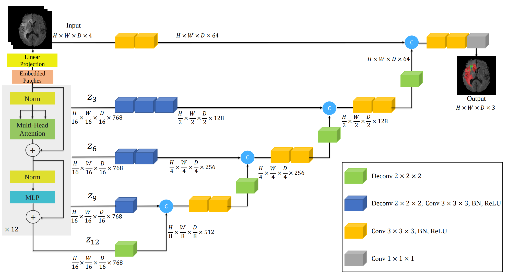
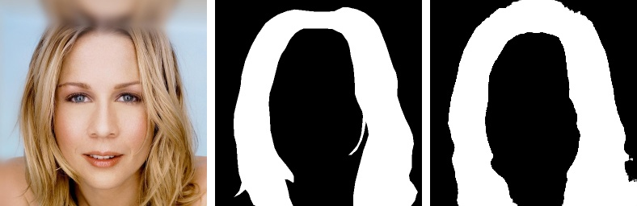

# Image-Segmentation-using-UNETR
This GitHub repository demonstrates the utilization of UNETR for Human Hair Segmentation using TensorFlow.

## Architecture

|  |
| :--: |
| *The block diagram of the Original UNETR model.* |

## Dataset
Privacy-Preserving Portrait Matting Dataset (P3M-10k) is used for the training and validation. P3M-10k contains 10421 high-resolution real-world face-blurred portrait images, along with their manually labeled alpha mattes.   
Download the dataset: Soon.

## Results
The sequence in the images below is `Input Image`, `Ground Truth` and `Prediction`.    
|  |
| :--: |
|  |
|  |

## How to improve
- Train on more epochs.
- Increase the input image resolution.
- Apply data augmentation.

## Contact
For more follow me on:

- <a href="https://www.youtube.com/idiotdeveloper"> YouTube </a>
- <a href="https://facebook.com/idiotdeveloper"> Facebook </a>
- <a href="https://twitter.com/nikhilroxtomar"> Twitter </a>
- <a href="https://www.instagram.com/nikhilroxtomar"> Instagram </a>
- <a href="https://t.me/idiotdeveloper"> Telegram </a>
